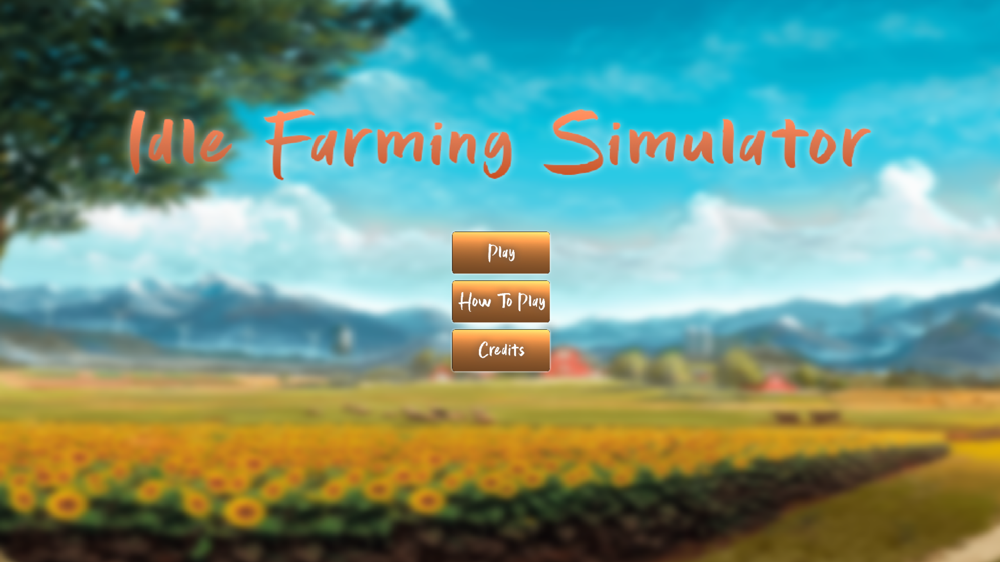
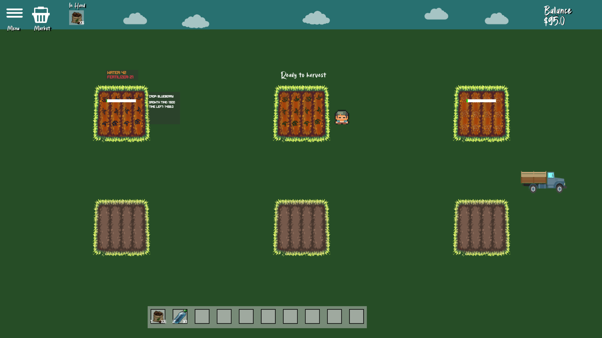

# Project Description
This project uses python with Pygame framework to create a 2D game where the player can purchase seeds, plant them, and harvest crops to earn money.

# Project background information
This project was created by four UIC students as part of the coding project for CS 440: Software Engineering I Spring 2024 course. This project was managed by everyone using Agile methodology with Jira, with weekly sprints and regular in person meetings to discuss progress and plan next steps. **Due to organization repository not being public, this repository was created to showcase the project**.

# Game Features
- **Seed Purchasing**: Players can buy different types of seeds using in-game currency.
- **Planting**: Players can plant seeds in designated areas.
- **Watering**: Players need to water the plants regularly to ensure they grow.
- **Fertilizing**: Players can use fertilizer to speed up the growth of their crops.
- **Harvesting**: Once the crops are fully grown, players can harvest them to earn money.
- **Selling Crops**: Harvested crops can be sold in the market for profit.

# Installation
1. Ensure you have Python installed on your machine. You can download it from [python.org](https://www.python.org/).
2. Install the Pygame library using pip:
   ```
   pip install pygame
   ```
3. Clone this repository to your local machine:
   ```
   git clone https://github.com/RayLo3097/farming-game
4. Navigate to the project directory:
   ```
    cd farming-game
5. Run the game:
   ```
    python main.py
   ```

# Game Screenshots



# Credits
This project was developed by: 
- [Raymond Lo](https://github.com/rlo6)
- [Tyler Alesse](https://github.com/TylerAlesse)
- [Prince Sonani](https://github.com/p-rinceS)
- [Daniel](https://github.com/dbarre8)